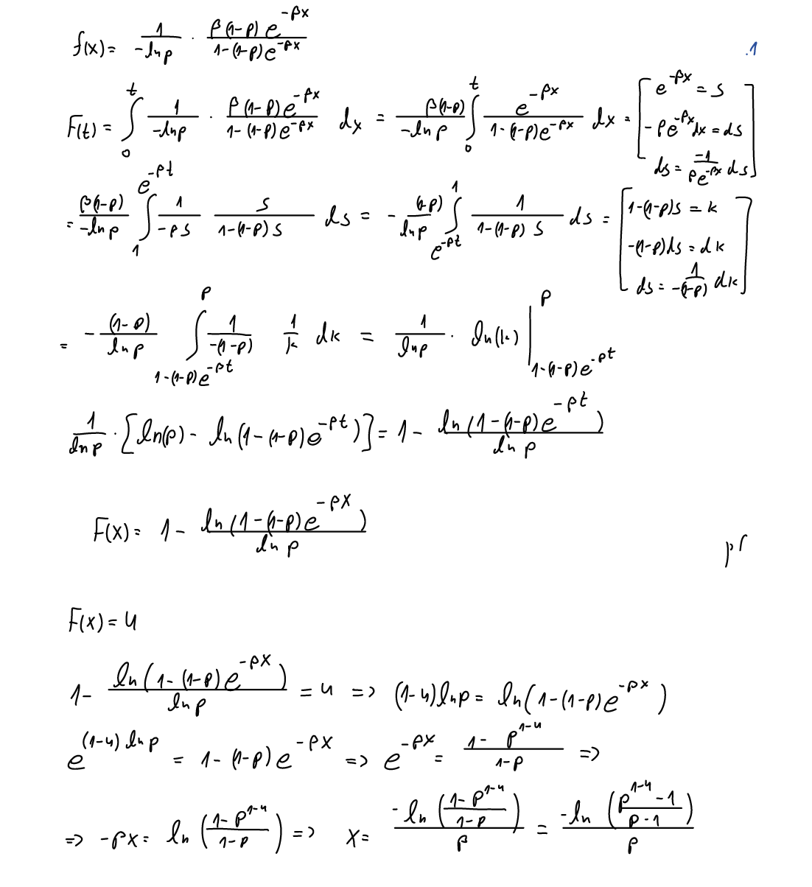
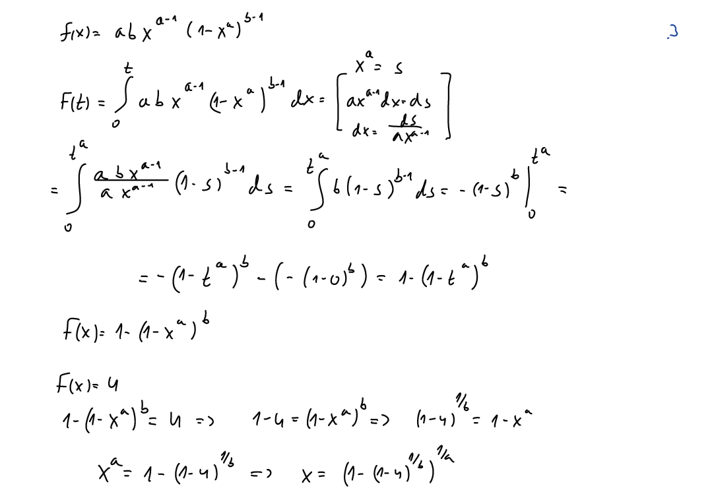
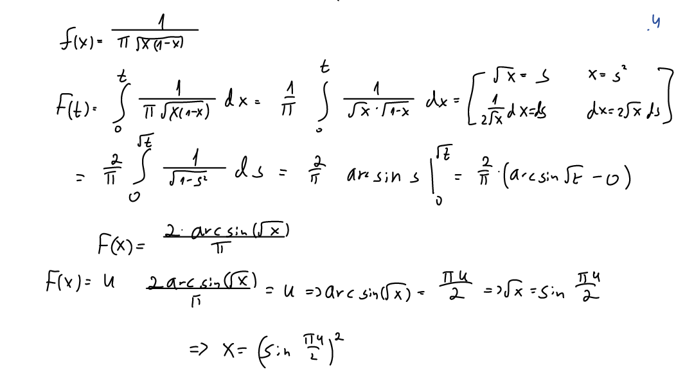
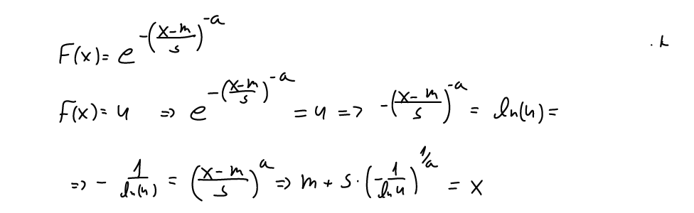
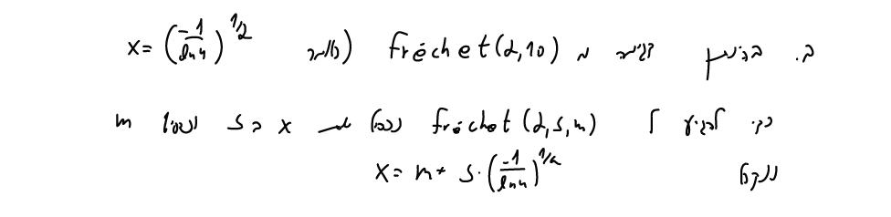
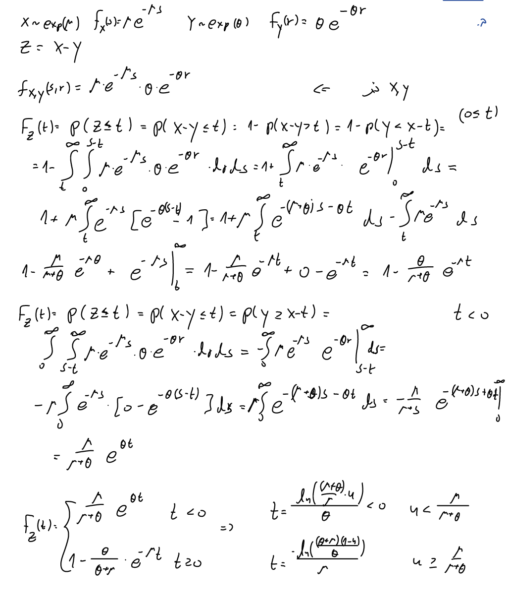
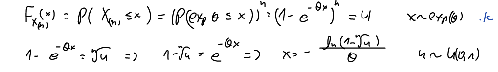
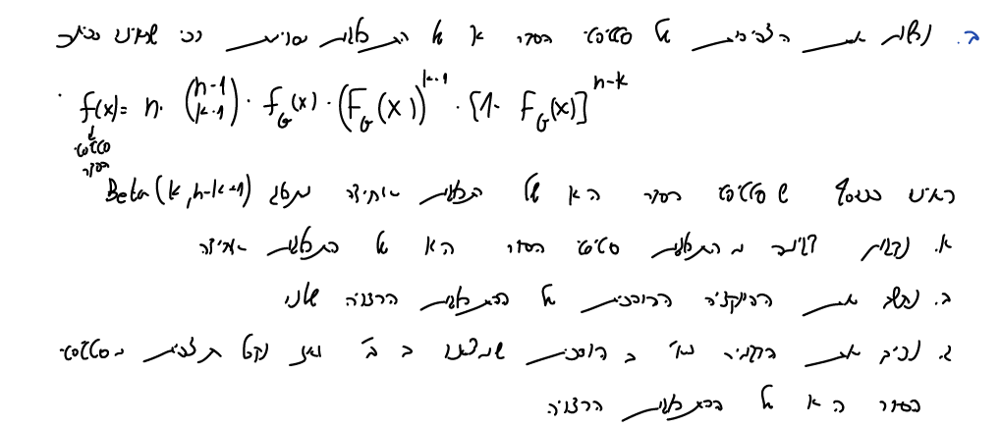
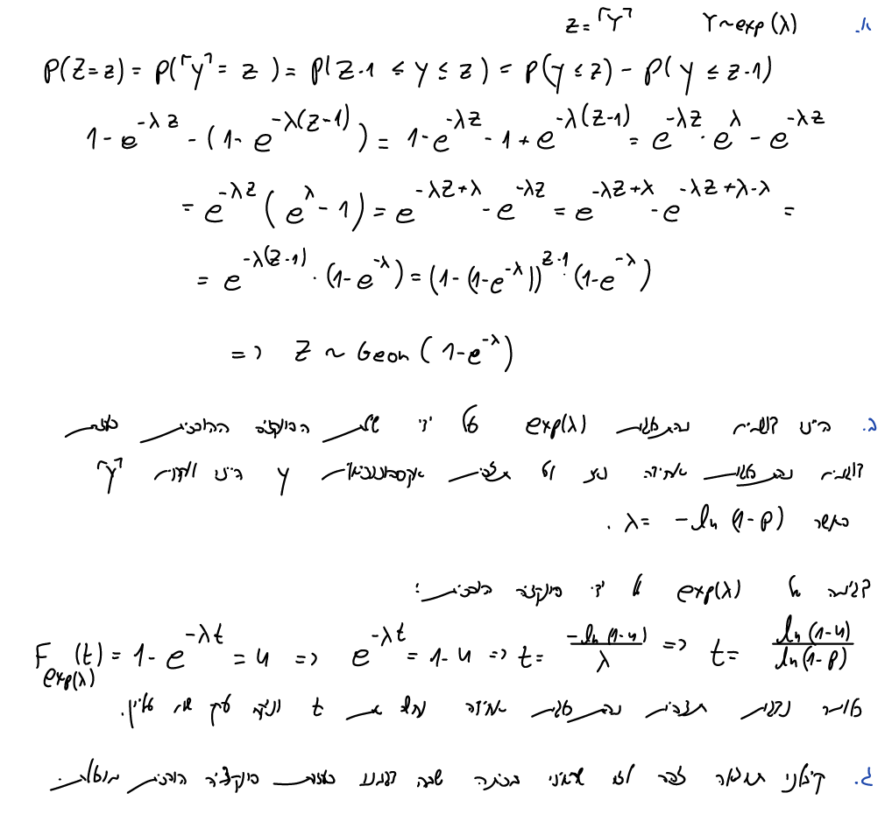

# Q1 #

## 1.1 ##

```{r}

```


```{r}
func_1.1 <- function(beta,p){
  inverse_func_1.1 <- function(u,beta,p){
    (-log(((p^(1-u))-1)/(p-1)))/beta
  } # Lets compute the inverse function: F(x)=u, u~U(0,1).
  U.1.1 <- runif(n = 10000,min = 0,max = 1) # Lets sample 10000 samples from U(0,1) distribution.
  X.1.1 <- inverse_func_1.1(U.1.1,beta,p) # For any u in U we compute the x value.
  hist(X.1.1,50)
  summary(X.1.1)
}

func_1.1(2,0.5)
```

## 1.2 ##


```{r}
knitr::include_graphics(c("1.2.1.png","1.2.2.png"))
```

```{r}
func_1.2 <- function(a,b,c){
  inverse_func_1.2 <- function(u,a,b,c){
    ifelse(test = u < ( (c-a)/(b-a) ), yes = (sqrt(u*(c-a)*(b-a)) + a), no = (b - sqrt((1-u)*(b-c)*(b-a))) )
    } # Lets compute the inverse function: F(x)=u, u~U(0,1).
  U.1.2 <- runif(n = 10000,min = 0,max = 1) # Lets sample 10000 samples from U(0,1) distribution.
  X.1.2 <- inverse_func_1.2(U.1.2,a,b,c) # For any u in U we compute the x value.
  hist(X.1.2,50)
  summary(X.1.2)
  }

func_1.2(3,5,4)

```

## 1.3 ##


```{r}

```

```{r}

func_1.3 <- function(a,b){
  inverse_func_1.3 <- function(u,a,b){
    (1-(1-u)^(1/b))^(1/a)
    } # Lets compute the inverse function: F(x)=u, u~U(0,1).
  U.1.3 <- runif(n = 10000,min = 0,max = 1) # Lets sample 10000 samples from U(0,1) distribution.
  X.1.3 <- inverse_func_1.3(U.1.3,a,b) # For any u in U we compute the x value.
  hist(X.1.3,50)
  summary(X.1.3)
  }

func_1.3(3,3)
```


## 1.4 ##

```{r}

```

```{r}
func_1.4 <- function(){
  inverse_func_1.4 <- function(u){
    (sin((pi*u)/2))^2
    } # Lets compute the inverse function: F(x)=u, u~U(0,1).
  U.1.4 <- runif(n = 10000,min = 0,max = 1) # Lets sample 10000 samples from U(0,1) distribution.
  X.1.4 <- inverse_func_1.4(U.1.4) # For any u in U we compute the x value.
  hist(X.1.4,50)
  summary(X.1.4)
  }

func_1.4()

```

## 1.5 ##
### a ###
```{r}

```

```{r}
func_1.5 <- function(alpha,s,m){
  inverse_func_1.5 <- function(u,alpha,s,m){
    m + s * (-1/log(u))^(1/alpha)
    } # Lets compute the inverse function: F(x)=u, u~U(0,1).
  U.1.5 <- runif(n = 10000,min = 0,max = 1) # Lets sample 10000 samples from U(0,1) distribution.
  X.1.5 <- inverse_func_1.5(U.1.5,alpha,s,m) # For any u in U we compute the x value.
  hist(X.1.5)
  summary(X.1.5)
  }

func_1.5(alpha = 3,s = 2,m = 5)

```

### b ###

```{r}

```

# Q2 #

X~exp(mu), Y~exp(theta), z = X - Y (X and Y are independent)

## a ##
calculation of Z in 'naive' way:

```{r}
X <- rexp(n = 10000,rate = 0.5)
Y <- rexp(n = 10000,rate = 0.2)
Z.naive <- X - Y

hist(Z.naive,50)

```

## b ##
calculation of Z with ITS:

```{r}

```

```{r}

func_2.B <- function(mu,theta){
  inverse_func_2.B <- function(u,mu,theta){
    ifelse(test = u > mu/(theta+mu) , yes = -log((mu+theta)*(1-u)/theta) / mu , no =  log((mu+theta)*(u)/mu) / theta)
    } # Lets compute the inverse function: F(x)=u, u~U(0,1).
  U.2.B <- runif(n = 10000,min = 0,max = 1) # Lets sample 10000 samples from U(0,1) distribution.
  X.2.B <- inverse_func_2.B(U.2.B,mu,theta) # For any u in U we compute the x value.
  X.2.B
  }

Z.ITS <- func_2.B(mu = 0.5, theta = 0.2)
hist(Z.ITS,50)
summary(Z.ITS)

```

## c ##
comparison between Z, using qqplot, calculated in 'naive' way and ITS:

```{r}
qqplot(Z.naive,Z.ITS)
```

# Q3 #

## a ##

```{r}

```

```{r}
max_exp_function <- function(n,theta,n.3){
  U.3 <- runif(n = n,min = 0,max = 1) # Lets sample 10000 samples from U(0,1) distribution.
  - log(1-(U.3)^(1/n.3)) / theta
}

Q.3.a <- max_exp_function(n = 10000,theta = 2,n.3 = 30)

hist(Q.3.a,50)
summary(Q.3.a)

```


## b ##

```{r}

```

## c ##

```{r}
knitr::include_graphics("3.3.png")
```

# Q4 #

```{r}

```


